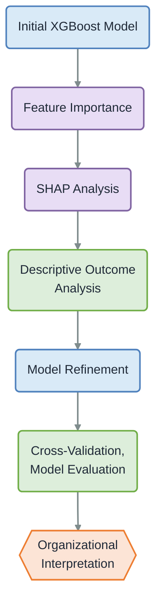

# XGBoost Analysis of No Surprises Act Dispute Outcomes
## Health insurers are sometimes paying healthcare providers _more than 18 times_ the median price for emergency medical services.
Let's say you go to the hospital for an emergency, and you are treated by an out-of-network doctor, meaning that your insurance doesn't cover their services. Thanks to the No Surprises Act, your insurance company will cover the "surprise" cost, but they will have to negotiate a price for that service with that provider. If they can't agree on a price, they will initiate a dispute process. 

According to the Congressional Research Service, these disputes have heavily favored healthcare providers, with providers winning vast majority of disputes and sometimes **_charging insurers more than 18 times the median price_** of that service. This is cause for concern, especially since higher costs to insurance companies can lead to health insurance becoming more expensive for all patients. Currently, policy research has focused on win rates and types of services, but none have investigated the outcomes of these disputes using machine learning. To further understand these No Surprises Act disputes, I have used XGBoost to help uncover patterns and inform research on this dispute process.

## Project Overview
The objective of this project is to examine whether various factors in the arbitration process are associated with either provider or insurer wins in the Independent Dispute Resolution (IDR) process established under the No Surprises Act. This project uses an XGBoost binary classifier to examine patterns associated with these arbitration outcomes. Rather than treating model performance as the endpoint, the analysis uses feature importance, SHAP values, descriptive analysis, and cross-validation to investigate unexpected predictive signals and interpret their substantive implications.

The analysis proceeds in three stages: an initial model, a refined model, and investigation of the highest-gain features. A separate interpretive analysis links high-impact features to real-world entities to investigate whether the observed predictive signals reflect broader organizational or structural characteristics. 

### The Initial Model
The initial model identified provider Practice/Facility Size as the highest gain feature. However, subsequent SHAP and descriptive analyses showed that missing facility-size information was strongly associated with default decisions, in which a party does not show up to a negotiation and thus loses by default. This motivated a refined analysis that explicitly excluded these default disputes.

### The Refined Model and an Unexpected Outcome
In the refined model, Provider Email Domain emerged as a dominant predictor. Further analysis of the data found substantial differences in both model contribution and observed outcomes across provider email domains. Examination of the organizations associated with high-impact domains suggests that the feature may function as a proxy for organizational identity or dispute management styles.

## Analytical Approach

The analysis combines gradient-boosted decision trees with model interpretation and descriptive analysis. XGBoost was used to model arbitration outcomes, while gain based feature importance and SHAP values were used to identify and investigate influential predictors. Descriptive outcome comparisons were then used to examine whether model-derived patterns were reflected in the observed data. Model refinement was evaluated using a test set and a stratified four-fold cross-validation to assess stability of the signal, since there was class imbalance of about 85-15. 

The final interpretive analysis examined high-impact features at the organizational level to assess whether their predictive signal could be associated with broader organizational or structural characteristics.
### Summary of Analytic Workflow

## Key Findings
### 1. The initial model identified Practice/Facility Size as the strongest predictor.

The initial XGBoost model identified Practice/Facility Size as the highest-gain feature, substantially exceeding the next most important predictor. This prompted further investigation using SHAP values and descriptive analysis, rather than treating feature importance as an endpoint.

### 2. Missing Practice/Facility Size was strongly associated with default decisions in favor of insurers.

Among disputes with an unknown Practice/Facility Size, a vast majority (99.32%) were default decisions, compared to the default rates of about 20% among disputes with reported facility-sizes. These default disputes with unknown facility size were also overwhelmingly decided in favor of the insurer (97.99%). Together, these patterns suggest that unknown Practice/Facility Size may be capturing disputes in which the provider or facility is not participating in the dispute, thus resulting in a default decision.

### 3. Removing default decisions substantially changed the model's feature structure.

After excluding default decisions, Practice/Facility Size fell from the highest gain feature to fourteenth, while Provider Email Domain went from the second to the highest gain feature. The refined model achieved a held-out test AUC of 0.8818, compared to approximately 0.91 for the initial model. The model's mean four-fold cross-validation AUC was 0.8746 with SD = 0.0015, suggesting that the model is quite stable.

### 4. Provider Email Domain captured substantial differences in arbitration outcomes.

Provider Email Domain showed substantial variation in signed SHAP contributions across domains. Among email domains with at least 10,000 observations, domains with negative mean SHAP values generally had lower provider/facility outcome rates, while domains with positive mean SHAP values generally had higher provider/facility outcome rates. For example, `totalcare.us` had a mean SHAP value of −1.29 and a provider/facility outcome rate of 62.72%, while `mbbrm.com` had a mean SHAP value of +0.81 and a provider/facility outcome rate of 98.39%.

#### Select Examples of Provider Email Domains, Mean SHAP Values, and Observed Win Rates
| Provider Email Domain | Mean SHAP Value | Observations | Provider/Facility Win Rate |
| --------------------- | --------------: | -----------: | -------------------------: |
| `totalcare.us`        |          -1.288 |       34,960 |                     62.72% |
| `envisionhealth.com`  |          -0.644 |       40,608 |                     68.81% 
| `specialtycare.net`   |          -0.276 |       18,985 |                     85.79% |
| `radpmg.com`          |          +0.531 |       22,242 |                     91.40% |
| `saparm.com`          |          +0.597 |      181,054 |                     92.08% |
| `teamhealth.com`      |          +0.605 |      137,434 |                     90.55% |
| `scphealth.com`       |          +0.644 |       10,363 |                     89.92% |
| `mbbrm.com`           |          +0.806 |       22,454 |                     98.39% |

**Note:** Table includes provider email domains with at least 10,000 observations. Mean SHAP values represent the average contribution of each domain to the model's prediction, while the provider/facility win rate represents the observed percentage of non-default disputes decided in favor of the provider/facility.

### 5. The provider email domain signal was stable across validation folds.

The direction of the Provider Email Domain effects remained consistent across four validation folds. For example, `envisionhealth.com` had negative mean SHAP values in every fold, while `saparm.com` and `teamhealth.com` had positive values in every fold. This consistency suggests that the domain-level signal was not driven by a single subset of the training data.

## Interpretation of Results
The strongest predictive features identified by the models appear to capture characteristics of the organizations and processes surrounding IDR disputes, rather than individual characteristics of certain disputes.

The relationship between Practice/Facility Size and default decisions suggests that missing facility information may have served as a proxy for the default decision in the initial model. After default decisions were excluded, Provider Email Domain emerged as the dominant feature.

Provider Email Domain is not itself a substantive characteristic of an arbitration dispute. Rather, it identifies the organizational affiliation of a provider. The consistency of the domain effects across validation folds, combined with the observed differences in arbitration win rates, suggests that the feature may be capturing broader organizational or dispute management characteristics.

This interpretation remains an association rather than a causal finding. The analysis does not establish that an organization's identity or representation practices cause a particular arbitration outcome. Instead, it demonstrates how model interpretation can reveal potentially meaningful structural patterns that may not be apparent from conventional data analysis alone.

## Data & Methodology

### Data
The analysis uses the publicly available 2024 data on the Independent Dispute Resolution (IDR) process from the Centers for Medicare and Medicaid Services (CMS). Data can be found [here.](https://www.cms.gov/nosurprises/policies-and-resources/reports)
The dataset contains information about disputes submitted through the IDR process, including provider, insurer, and arbiter characteristics, as well as dispute characteristics. The analysis combines four quarterly public use files covering Q1 through Q4 of 2024 and contains about 1.2 million observations. Variables were cleaned, standardized, and filtered to construct the modeling dataset. 

### Target
The target variable represents the selected arbitration outcome: whether the outcome was in favor of the plan/issuer or the provider/facility. The target was encoded as a binary variable, with 0 representing plan/issuer outcomes and 1 representing provider/facility outcomes.

### Feature Engineering and Preprocessing

Variables directly related to the target outcome were excluded from the predictor dataset. Identifier and descriptive fields that were not appropriate as model predictors were also removed. Categorical variables were retained using XGBoost's categorical feature support, while numeric fields were converted to appropriate numeric types.

### Model
The analysis uses XGBoost, a gradient-boosted decision-tree model, with a binary logistic objective. The model was configured with a maximum tree depth of 6, a learning rate of 0.3, and 175 boosting rounds. For more information on the model, please see `refined_idr_model.py`.

### Evaluation
The data were divided into training and held-out test sets using a 67/33 split. The refined analysis additionally used four-fold stratified cross-validation within the training data to assess performance consistency across different subsets of the data. Model performance was evaluated using ROC AUC and precision-recall AUC (PR AUC). ROC AUC was used to assess overall ranking performance, while PR AUC was used to examine performance for the individual outcome classes, particularly the less-common plan/issuer outcome.

| Evaluation                    | Metric                   |     Result |
| ----------------------------- | ------------------------ | ---------: |
| Refined model —  test | ROC AUC                  | **0.8818** |
| Refined model —  test | Provider/facility PR AUC | **0.9755** |
| Refined model —  test | Plan/issuer PR AUC       | **0.6340** |
| Refined model — 4-fold CV     | ROC AUC, mean            | **0.8746** |
| Refined model — 4-fold CV     | ROC AUC, SD              | **0.0015** |

## Limitations
### - Observational data limits causal interpretation.

The analysis identifies associations between available dispute characteristics and arbitration outcomes, but does not establish causal relationships. For instance, the observed relationships between provider email domains and arbitration outcomes should not be interpreted as evidence that organizational identity or representation practices cause particular outcomes.

### - Provider Email Domain may capture one or many unobserved organizational characteristics.

Provider Email Domain may contain information about organizational identity, representation, specialty, or dispute-management practices that are not explicitly represented elsewhere in the dataset. While the stability of domain-level effects across validation folds supports the predictive signal, additional data would be required to determine which underlying organizational characteristics account for the observed differences.

### - Missing data may contain important information.

The strong relationship between missing Practice/Facility Size and default decisions illustrates a broader limitation of the analysis. Specifically, missing values may reflect characteristics of how disputes enter or proceed through the IDR process, rather than simple random error. For future analyses, treating a missing value as a feature may allow the model to capture process-related signals that are difficult to interpret substantively.

### - Model performance does not establish substantive importance.

Feature importance and SHAP values describe how the model uses available predictors, but they do not establish that a feature is substantively important to the underlying arbitration process. A feature can be highly predictive because it acts as a proxy for other unmeasured characteristics.

### - The data is limited in scope.

This analysis is based on the 2024 Federal IDR Public Use Files and therefore reflects disputes represented in that reporting period. Patterns observed in these data may not generalize to other periods, changes in the IDR process, or disputes outside the Federal IDR system.

##  Further investigation
Future analysis could incorporate additional organizational and dispute-level variables to determine which underlying characteristics are responsible for the predictive signals associated with provider email domains. 
